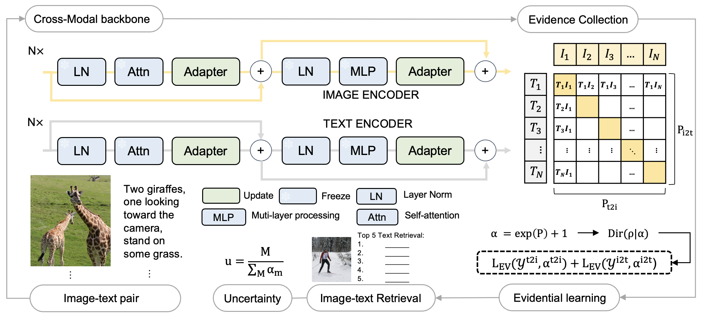

# ELIP

[Paper]()

Evidential Language-Image Posterior (ELIP) achieves robust alignment between web images and semantic knowledge across various OOD cases by leveraging evidential uncertainties. The proposed ELIP can be seamlessly integrated into general image-text contrastive learning frameworks, providing an efficient fine-tuning approach without exacerbating the need for additional data. 
 

## Approach




## Usage

First, [install PyTorch 1.7.1](https://pytorch.org/get-started/locally/) (or later) and torchvision, as well as small additional dependencies, and then install this repo as a Python package. On a CUDA GPU machine, the following will do the trick:

```bash
$ conda install --yes -c pytorch pytorch=1.7.1 torchvision cudatoolkit=11.0
$ pip install -r requirements.txt
```

Replace `cudatoolkit=11.0` above with the appropriate CUDA version on your machine or `cpuonly` when installing on a machine without a GPU.


## Data

### Training data

Downlaod raw image of COCO2014 and FLickr from the official website.
We use the annotation file from Karpathy split of COCO to train the model.

### OOD image and text preparation (for testing)

We kindly follow this work to generate our OOD images [link](https://github.com/Jason-Qiu/MM_Robustness).

## Evaluation (Image-Text Retrieval)

To evaluate the finedtuned ELIP, 

1. Modify the config files located in /configs:
- `*_root`: the root path of images and annotations.
- `dataset`: coco / flickr.
- `pretrained`: finetuned weights of ELIP.

2. Run the following script:

 ```bash
python -m torch.distributed.run --nproc_per_node=1 \
    train_retrieval.py \
    --config configs/retrieval_*_eval.yaml \
    --output_dir /path/to/output \
    --evaluate
```

## Training

1. Finetuning ELIP with multiple GPUs please run:

```bash
python -m torch.distributed.run --nproc_per_node=4 \
    train_retrieval.py \
    --config configs/retrieval_coco_finetune-noEV.yaml \
    --output_dir /path/to/output \
    --seed 255
```


## Citation
If you find this code to be useful for your research, please consider citing.
```bash
@inproceedings{ELIP,
  title={Aligning Out-of-Distribution Web Images and Caption Semantics via Evidential Learning},
  author={Guohao Sun and Yue Bai and Xueying Yang and Yi Fang and Yun Fu and Zhiqiang Tao},
  booktitle = {ACM Web Conference},
  year={2024},
}
```

## Acknowledgement

The implement of ELIP relies on sources from CLIP. We thank the original authors for their open-sourcing.

